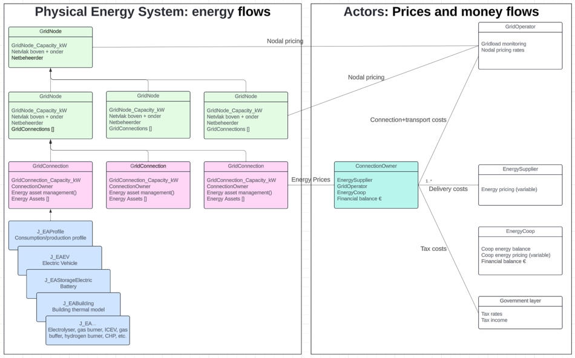

# Welcome to the Zenmo Zero Model Documentation

The Zenmo Zero Engine is an AnyLogic-based multi-agent simulation framework for modelling annual energy system scenarios. It calculates energy flows, manages grid operations, and tracks economic transactions across distributed energy assets.

 

## Kernprincipes van het model

* **Geen expliciete stroom/spanningssimulatie** – Alleen vermogens (kW) en vermogensbalansen worden gemodelleerd, geen load-flow berekening.
* **’Koperen plaat’ netvlakken** – Kabels hebben geen beperkte capaciteit. Congestie wordt alleen gemodelleerd op transformatoren (GridNode).
* **Warmtenetten** – Warmtebalansen worden gesloten via GridNode Heat. Er wordt geen warmtenet-infrastructuur (leidingen, drukken) gemodelleerd.
* **Gas en waterstof** – Er is geen infrastructuurmodel voor gas of waterstof, maar bufferopslag (J_EAStorageGas) is wel mogelijk.
* **Tijdresolutie** – Standaard kwartierresolutie (15 minuten); instelbaar via `p_timestep_h`.
* **Jaarsimulatie** – De engine doorrekent een volledig jaar (8760 uur) zelfstandig, zonder gebruik van AnyLogic’s ingebouwde tijdsfuncties.

## Documentatie-overzicht

| Pagina | Inhoud |
|--------|--------|
| [Modelstructuur](modelstructuur.md) | Agënthiërarchie, simulatieverloop, agent-rollen |
| [Modeling conventions](modeling_conventions.md) | Naamgeving, eenheden, conventie voor tijdintegratie |
| [Rekenregels](rekenregels.md) | Energiebalans, consistentiecheck, wet van behoud van energie |
| [Energy assets](energy_assets.md) | Overzicht van alle energy asset-typen en hun sturing |
| [Energieprijzen en geldstromen](prijzen_en_geldstromen.md) | Marktprijsmechanisme, contracten, financiële KPIs |
| [KPI berekeningen](KPI_berekeningen.md) | Hiërarchische KPI-berekening, datasets, array-conventie |
| [Datasets](datasets.md) | Dataopslag, tijdreeksen, array- vs. Dataset-gebruik |
| [Interfaces met andere modules](interfaces.md) | Koppeling met project-main model en results_ui |
| [Results UI](results_ui.md) | Resultatenvisualisatie via zero_results_UI |

## mkDocs

Made using mkDocs:
For full documentation visit [mkdocs.org](https://www.mkdocs.org).

## Commands

* `mkdocs new [dir-name]` - Create a new project.
* `mkdocs serve` - Start the live-reloading docs server.
* `mkdocs build` - Build the documentation site.
* `mkdocs -h` - Print help message and exit.

## Project layout

    mkdocs.yml    # The configuration file.
    docs/
        index.md  # The documentation homepage.
        ...       # Other markdown pages, images and other files.
